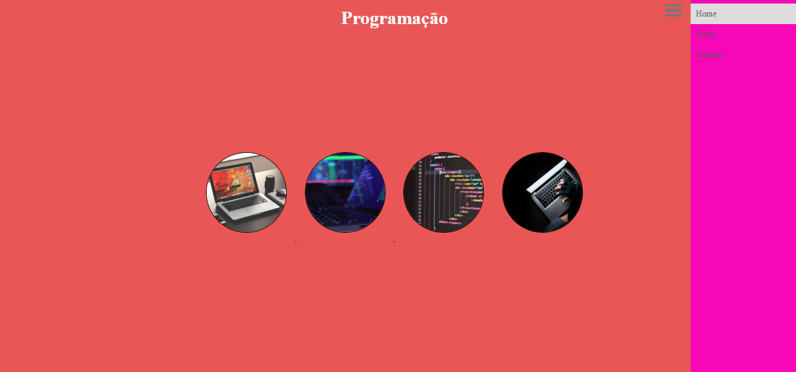
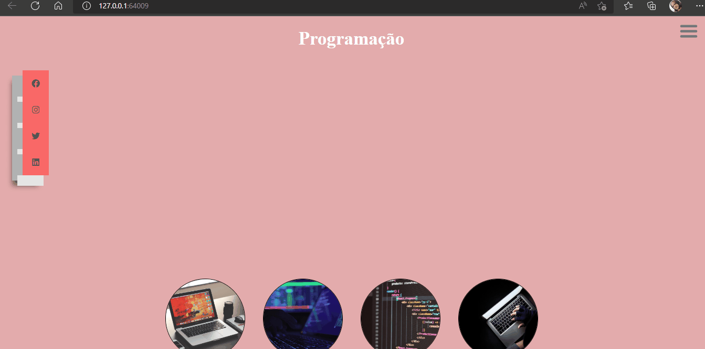

#### Projeto testando conhecimentos

#### Criar um menu que quando for clicado ele fecha, quando clicado novamente ele abre.

[]

[]

[]

[]

### Tecnologias Utilizadas 

 

  
  
  

### Márcia 

 [ ]
